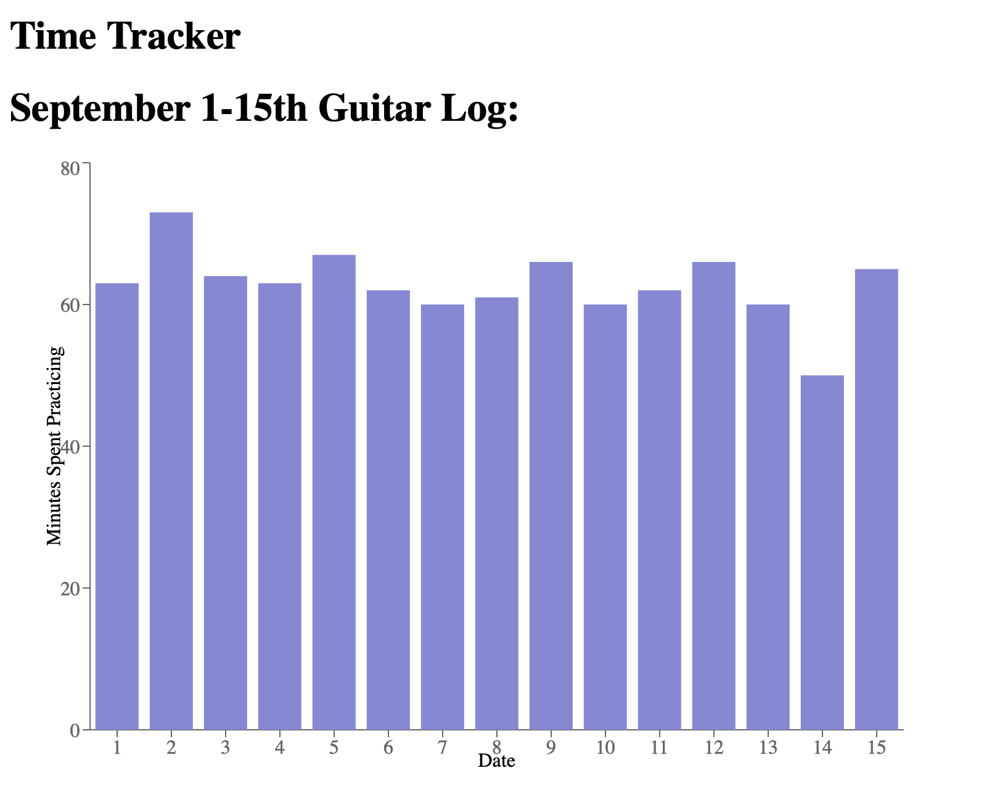

# time-tracker

# Index

- [Plan](#Plan)
- [Stack](#Stack)
- [Design](#Design)
  - [Routes](#Routes)
  - [Project Organization](#Project-Organization)
- [Models](#Models)
- [Functionality](#Functionality)

# Key

- 🏁 : in progress
- ❌ : not done
- ✅ : complete

# Plan

- User application 🏁
  - Handle users 🏁
    - utilizes JWTs & bcryptjs ✅
    - Login: username & password ✅
    - Logout ✅
    - Delete Account ❌
    - Edit account ❌
- Functionality 🏁
  - \<user> can log times for an \<activity> 🏁
  - \<user> can view charts of times recorded for various \<activity> 🏁
    - month view
      - view past months
    - year view ❌
      - view past years
  - \<user> can create and delete \<activity> ❌

# Stack

## MERN Stack

- MongoDB
- Express
- React
- Node

## Frontend

- React app
  - useContext: to keep track of user & how page should display
    - userContext
  - axios: for http req/res
  - useHistory: to keep track of routes

## Backend

- Node
- express
- mongoose
- cors : cross origin resource sharing
  - can specify which origins can access the api
  - only secure through browser, not command line
- detenv
- bcryptjs
- jsonwebtoken

# Design

## Routes

#### api/users/

- ALL 🏁:
  - DONE ✅
    - register, login, validateToken
  - TO DO ❌
    - delete, edituser, activities, addactivity
- POST
  - api/users/register : Create a new account ✅
    - body
      - username: \<string>
      - password: \<string>
      - verifyPassword: \<string>
      - email: \<email>
  - /users/login : Log in ✅
    - body
      - username: \<string>
      - password: \<string>
  - /users/validateToken ✅
    - header
      - key: x-auth-token
      - value: \<string>
  - /users/addactivity
    - header
      - key: x-auth-token
      - value: \<string>
    - body
      - activity: \<string>
- GET
  - api/users/activities 🏁:
    - header
      - key: x-auth-token
      - value: \<string>
- DELETE
  - api/delete : Delete a user ❌
    - header
      - key: x-auth-token
      - value: \<string>
    - body
      - username: \<string>
  - api/edituser : edit user info ❌
    - header
      - key: x-auth-token
      - value: \<string>
    - body
      - to be determined

#### api/log ✅

- POST
  - api/log/new: creates new log ✅
    - header
      - key: x-auth-token
      - value: \<string>
    - body
      - activity: \<string>
      - date: UTC time
      - minutes: \<int>
- GET
  - api/log/getlogs: gets all logs for the user ✅
    - header
      - key: x-auth-token
      - value: \<string>

## Project Organization

#### NEEDS UPDATING

- `backend/`
  - `index.js ` : sets up server and routes
  - `.env` : holds mongodb connection string && JWT secret key
  - `middleware/`
    - `auth.js` : verifies request data w/ jwt & supplies user id
  - `models/`
    - `userModel.js` : defind user
  - `routes/`
    - `userRouter.js` : routes for user
    - `timeLogRouter.js` : routes for time logs
- `frontend/`
  - `public/`
    - `index.html` : html skeleton for React
  - `src/`
    - `App.js` : holds react router and the user context
    - `index.js` : Renders the App into html
    - `style.css` : styles for the whole page
    - `components/`
      - `auth/`
        - `Login.js` : used to log in user
        - `Register.js` : used to register a user
        - `AuthOptions.js` : determines what header user sees if logged in/out
      - `pages/`
        - `Home.js` : what user sees when logged in (otherwise they see login page)
      - `layout/`
        - Header.js
        - Footer.js
    - context /
      - `UserContext.js` : initializes and holds context

# UI Design

- Example utilizing the Recharts API to create a graph:
  - refer to old file for implementation

[See Future Design Concept Here](https://www.figma.com/file/hqnRBUyQbHOPRZnKp6D2Df/Time-Tracker)

# Models

## User:

- username
- email
- password
- event log topic array?

## Event Log:

- userid
- startTime
- endTime
- eventType

# Functionality

- Users handling
  - login
  - register
  - logout
- Log handling
  - add time log
  - view time logs
